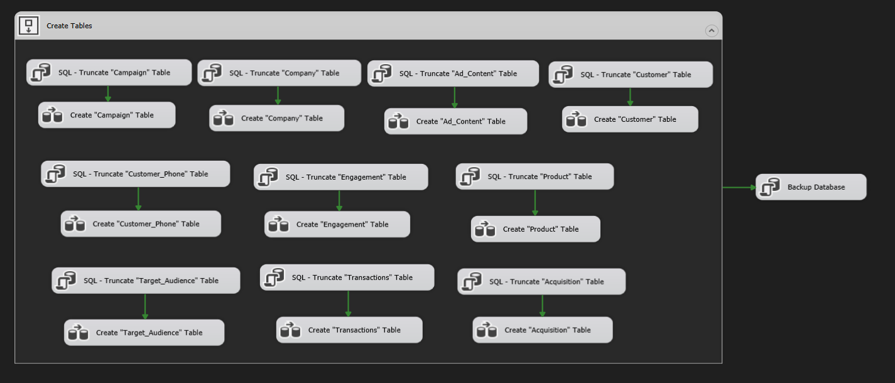

# Operational Database Design (ERD)
  

## 1. Entities Description
### Company
- **Represents**: Major electronics companies (Apple, Samsung, Sony, Lenovo, Dell, Huawei).
- **Attributes**: Company_ID (PK), Company_Name, Country, Website_Name, URL, Industry_Focus, Founded_Year.

### Campaign
- **Represents**: Marketing campaigns launched by companies.
- **Attributes**: Campaign_ID (PK), Company_ID (FK), Campaign_Name, Impressions, Clicks, Budget, Actual_Budget, Objective, Objective_Description, Revenue, Start_Date, End_Date, Duration, CTA, Platform_Name.

### Ad Content
- **Represents**: Creative materials used in campaigns.
- **Attributes**: Campaign_ID (FK), Creative, Headline, Description.

### Target Audience
- **Represents**: Audience segments per campaign.
- **Attributes**: Target_Audience_ID (PK), Campaign_ID (FK), Interests, Behavior, Location, Min_Age, Max_Age.

### Product
- **Represents**: Products promoted/sold during campaigns.
- **Attributes**: Product_ID (PK), Company_ID (FK), Product_Name, Color, Category, Price, Stock, Availability, Landing_Page.

### Customer
- **Represents**: Customers who purchased or interacted with campaigns.
- **Attributes**: Customer_ID (PK), Target_Audience_ID (FK), First_Name, Last_Name, Gender, Age, City, Country, Email, Purchase_Flag.

### Customer Phone
- **Represents**: Customer phone numbers.
- **Attributes**: Customer_ID (PK, FK), Phone_1, Phone_2.

### Transaction
- **Represents**: Customer purchase transactions.
- **Attributes**: Transaction_ID (PK), Customer_ID (FK), Product_ID (FK), Total_Price, Payment_Method, Quantity, Transaction_Date.

### Engagement
- **Represents**: Digital engagement activities.
- **Attributes**: Company_ID (FK), Customer_ID (FK), Device_Type, OS, Event_Name, Event_Value, Event_Count, Session_Duration, Session_Number.

### Acquisition
- **Represents**: Customer acquisition details.
- **Attributes**: Campaign_ID (FK), Customer_ID (FK), Source, Medium, New_Users.

---
  

## 2. Tables & Relationships
- **Company** → One company runs multiple campaigns.  
- **Campaign** → Linked to Company, Ad Content, Target Audience.  
- **Ad Content** → Multiple creatives per campaign.  
- **Target Audience** → Defines audience segments for campaigns.  
- **Product** → Linked to Company; promoted in campaigns.  
- **Customer** → Linked to Target Audience.  
- **Customer Phone** → Stores customer contacts.  
- **Transaction** → Linked to Customer & Product.  
- **Engagement** → Links customers with companies through interactions.  
- **Acquisition** → Links campaigns with customers.  

---

## 3. Keys
### Primary Keys
- Company → Company_ID  
- Campaign → Campaign_ID  
- Ad Content → Campaign_ID (Composite Key)  
- Target Audience → Target_Audience_ID  
- Product → Product_ID  
- Customer → Customer_ID  
- Customer Phone → Customer_ID (also FK)  
- Transaction → Transaction_ID  
- Engagement → Company_ID + Customer_ID (Composite Key)  
- Acquisition → Campaign_ID + Customer_ID (Composite Key)  

### Foreign Keys
- Campaign → Company_ID  
- Ad Content → Campaign_ID  
- Target Audience → Campaign_ID  
- Customer → Target_Audience_ID  
- Customer Phone → Customer_ID  
- Transaction → Customer_ID, Product_ID  
- Product → Company_ID  
- Engagement → Company_ID, Customer_ID  
- Acquisition → Campaign_ID, Customer_ID  

---

## 4. Measures & Calculated Columns
- **Total Revenue** = SUM(Transaction.Total_Price)  
- **Total Quantity Sold** = SUM(Transaction.Quantity)  
- **Total Clicks** = SUM(Campaign.Clicks)  
- **Conversion Rate** = (Purchases ÷ Clicks) × 100  
- **Average Order Value (AOV)** = Total Revenue ÷ Number of Orders  
- **Customer Lifetime Value (CLV)** = AOV × Purchase Frequency × Customer Lifespan  

---

## 5. ETL Package (Excel → SQL Server OLTP)

  

### Purpose
- Standardize loading of Excel data into SQL Server OLTP.  
- Ensure data integrity for downstream BI tools.  

### Scope
- Covers: Campaign, Company, Ad_Content, Customer, Customer_Phone, Engagement, Product, Target_Audience, Transactions, Acquisition.  
- Handles table creation + full refresh.  

### Phases
1. **Table Preparation**  
   - Truncate existing data.  
   - Create/validate schema.  
2. **Data Loading**  
   - Excel Source → Transformations → Lookups → OLE DB Fast Load.  
   - Redirect invalid rows to error logs.  
3. **Backup**  
   - Full DB backup after successful load.  

---

## 6. Error Handling & Logging
- Invalid rows logged to error table/CSV.  
- OnError and OnTaskFailed handlers log and notify.  
- Audit table tracks load history.  

---

## 7. Performance Optimization
- Fast Load with batch commits.  
- Disable/rebuild indexes during large loads.  
- Optimized SSIS buffer sizes.  

---

## 8. Security
- Service account with least privilege.  
- Encrypted connection strings.  
- Backup files secured with restricted access.  

---

## 9. Maintenance & Monitoring
- Error logs + audit history retained.  
- Old backups cleaned regularly.  
- Monitoring dashboards (Power BI / SSRS) for ETL performance.  
