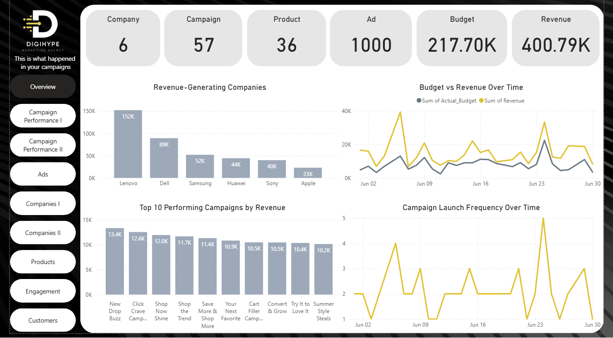
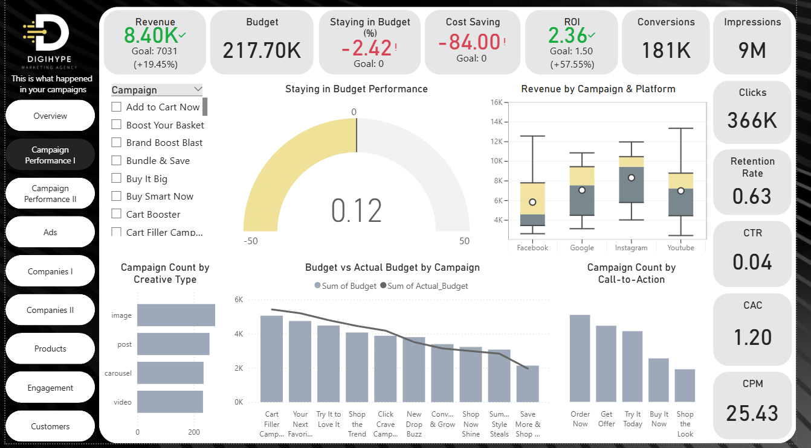
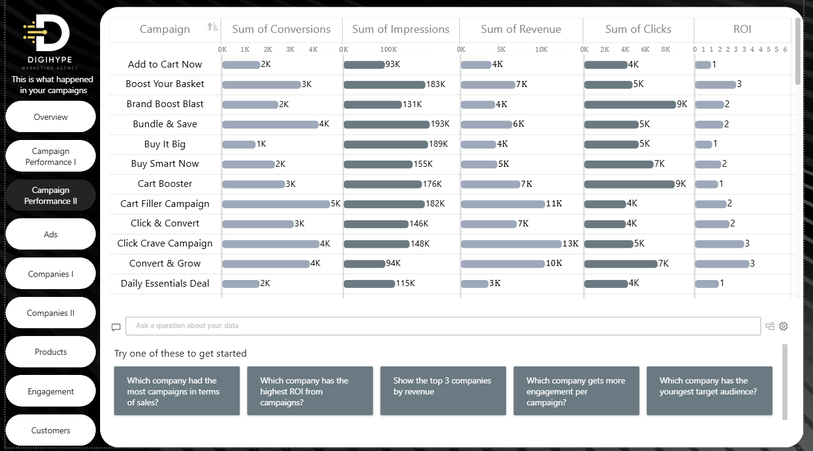
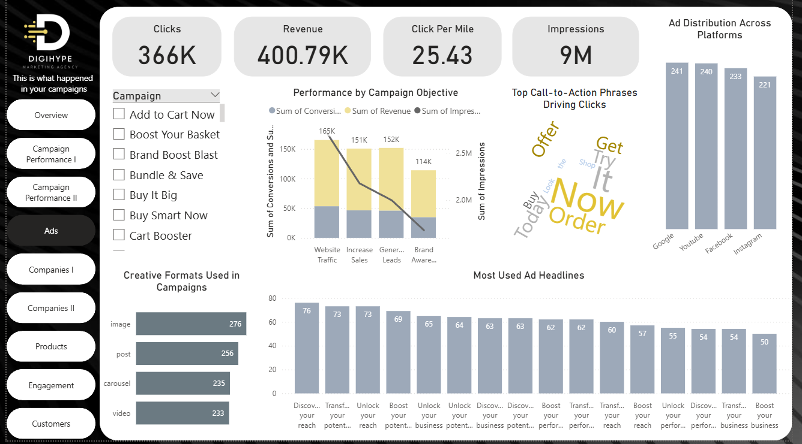
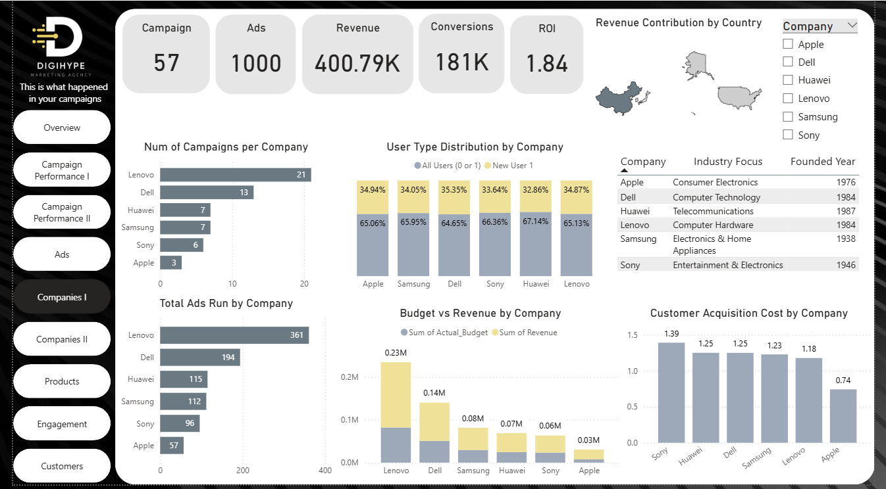
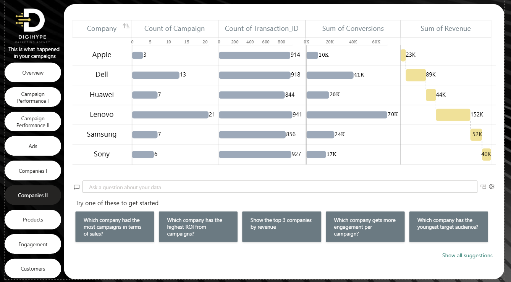
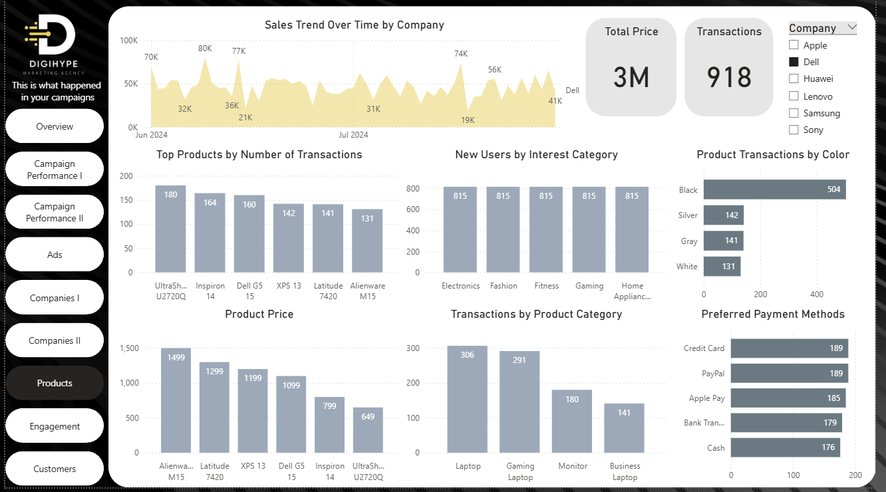
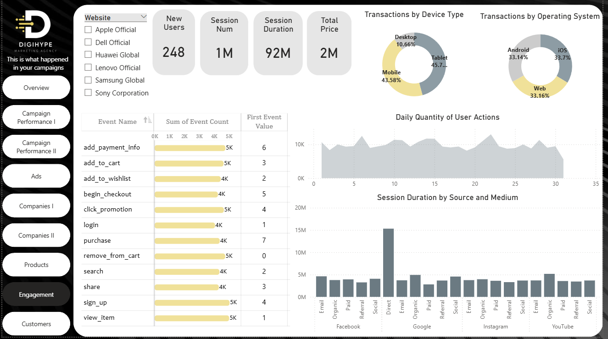
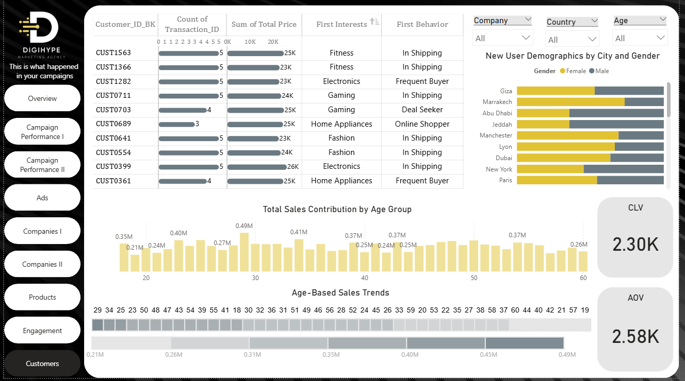

# Power BI Dashboard 

Power BI is a powerful business intelligence and data visualization tool developed by Microsoft.  
In this project, Power BI was used as one of the main front-end tools to present insights derived from our marketing campaign analysis.  

The tool allowed us to transform complex datasets into interactive dashboards and reports that are easy to explore and understand by both technical and non-technical users.  

By integrating data from our SQL Server Data Warehouse, Power BI enabled us to:  
- Connect seamlessly with the structured data models.  
- Create dynamic reports with drill-down capabilities.  
- Build KPIs that measure campaign performance across multiple dimensions (company, customer, and campaign).  
- Provide decision-makers with real-time and interactive access to insights.  

The use of Power BI not only improved the overall efficiency of data analysis but also allowed the team to communicate findings in a clear and visually appealing way, ensuring that stakeholders can quickly identify trends, patterns, and areas that require action.  

---

## Campaign Insights Dashboard 

  

### Key Performance Indicators (KPIs)  
- Companies: 6  
- Campaigns: 57  
- Products: 36  
- Ads: 1000  
- Budget: 217.70K  
- Revenue: 400.79K  

### Revenue-Generating Companies  
- Lenovo leads with 152K, followed by Dell (89K) and Samsung (52K).  
- Other contributors include Huawei, Sony, and Apple.  

### Top 10 Campaigns by Revenue  
- New Drop Buzz (13.4K), Click Crave Campaign (12.6K), Shop Now Shine (12.0K).  

### Budget vs Revenue Over Time  
- Revenue line shows spikes compared to budget, highlighting efficiency days.  

### Campaign Launch Frequency  
- Peaks indicate aggressive activity; useful to evaluate timing vs revenue.  

**Insights & Recommendations**  
1. Lenovo dominates revenue → Invest further in Lenovo’s strategy.  
2. Few campaigns drive most returns → Analyze high-performers.  
3. Spikes with low spend → Replicate efficient campaigns.  
4. Launch frequency not always effective → Optimize timing.  

---

## Campaign Performance I Dashboard  
  

### KPIs  
- Revenue: 8.40K (Goal: 7031, +19.45%)  
- Budget: 217.70K  
- ROI: 2.36 (Goal: 1.50, +57.55%)  
- Conversions: 181K  
- Impressions: 9M  
- Clicks: 366K  
- CTR: 0.04, CAC: 1.20, CPM: 25.43  

### Visuals  
- **Staying in Budget**: Gauge shows slight overspending.  
- **Revenue by Platform**: Instagram & Google strongest, Facebook & YouTube variable.  
- **Creative Type**: Images dominant, videos underutilized.  
- **CTA Distribution**: Mostly “Order Now”, “Get Offer”.  

**Insights & Recommendations**  
1. ROI strong → Focus on Instagram & Google.  
2. Overspending → Improve budget monitoring.  
3. Underused videos → Expand video-based ads.  
4. CTA diversity → Experiment with new persuasive phrases.  

---

## Campaign Performance II Dashboard  
  

### Highlights  
- **Top Conversions**: Cart Filler (5K), Bundle & Save (4K).  
- **Top Revenue**: Click Crave (13K), Cart Filler (11K).  
- **Top ROI Campaigns**: ROI=3 (Boost Your Basket, Convert & Grow).  
- **Engagement**: Brand Boost Blast & Cart Booster lead clicks (9K).  
- **Impressions Leaders**: Bundle & Save (193K).  

**Insights & Recommendations**  
1. High ROI campaigns → Allocate more budget.  
2. Low ROI (Buy It Big, Daily Essentials) → Reassess or cut.  
3. Engagement high, conversion moderate → Optimize funnels.  
4. Revenue concentration → Diversify campaigns.  
5. Weak creatives → Test new formats.  

---

## Ads Dashboard  
  

### KPIs  
- Clicks: 366K  
- Revenue: 400.79K  
- CPM: 25.43  
- Impressions: 9M  

### Insights  
- **Objectives**: Sales & Traffic perform best.  
- **Platforms**: Google (241), YouTube (240), Facebook (233), Instagram (221).  
- **Creative Formats**: Images dominate, videos & carousels underused.  
- **CTAs**: Mostly urgency-driven (Now, Order, Offer).  
- **Headlines**: Repeated phrases like “Boost your reach”.  

**Recommendations**  
- Double down on YouTube & Instagram videos.  
- Use diverse CTAs and headline variations.  
- Improve Brand Awareness campaigns.  

---

## Companies I Dashboard  
  

### KPIs  
- Campaigns: 57, Ads: 1000, Revenue: 400.79K, Conversions: 181K, ROI: 1.84  

### Key Points  
- **Lenovo**: Leader in campaigns, ads, and revenue (0.23M).  
- **Dell**: Strong mid-tier (0.14M).  
- **Apple**: Fewest campaigns, lowest revenue (0.03M).  
- **Sony**: Highest CAC (1.39).  

**Recommendations**  
- Sustain Lenovo strategy, scale Dell.  
- Expand Apple’s campaigns (low CAC = opportunity).  
- Reassess Sony targeting.  
- Leverage Huawei & Sony’s new user growth.  

---

## Companies II Dashboard  
  

- **Lenovo**: 21 campaigns, 70K conversions, 152K revenue.  
- **Dell**: 13 campaigns, 41K conversions, 89K revenue.  
- **Apple**: Only 3 campaigns, 23K revenue.  
- **Samsung**: 24K conversions, 52K revenue.  
- **Sony**: 6 campaigns, 40K revenue.  

**Recommendations**  
- Maintain Lenovo leadership.  
- Boost Dell ad volume.  
- Expand Apple activity.  
- Increase Huawei & Samsung spend.  
- Optimize Sony campaigns.  

---
## Products Dashboard  
  

### KPIs  
- **Total Price (Revenue):** 3M  
- **Total Transactions:** 918  

### Key Visuals & Insights  

1. **Sales Trend Over Time by Company**  
   - Shows revenue fluctuations between June and July 2024.  
   - Peaks: 80K (June), 74K (July).  
   - Dell and Lenovo consistently drive the largest shares.  

2. **Top Products by Number of Transactions**  
   - *UltraSharp U2720Q* leads with **180 transactions**, followed by *Inspiron 14* (164) and *Dell G5 15* (160).  
   - Indicates strong customer preference for laptops and monitors.  

3. **New Users by Interest Category**  
   - New users equally distributed across **Electronics, Fashion, Fitness, Gaming, and Home Appliances** (815 each).  
   - Highlights diversified user base.  

4. **Product Transactions by Color**  
   - **Black** dominates with 504 transactions (majority share).  
   - Silver (142), Gray (141), and White (131) trail far behind.  
   - Suggests strong customer inclination toward dark-colored products.  

5. **Product Price Distribution**  
   - High-value items: *Alienware M15 (1499)* and *Latitude 7420 (1299)*.  
   - Mid-range: *XPS 13 (1199)*, *Dell G5 15 (1099)*.  
   - Budget-friendly: *Inspiron 14 (799)*, *UltraSharp U2720Q (649)*.  
   - Wide price spectrum supports different customer segments.  

6. **Transactions by Product Category**  
   - Laptops (306) and Gaming Laptops (291) dominate.  
   - Monitors (180) and Business Laptops (141) smaller share.  
   - Confirms strong demand in laptop segment.  

7. **Preferred Payment Methods**  
   - Most used: Credit Card (189) and PayPal (189).  
   - Others: Apple Pay (185), Bank Transfer (179), Cash (176).  
   - Indicates digital payments are more popular than cash.  

### Business Impact  
- **Product Focus**: Laptops and gaming laptops are the most profitable segment → prioritize in campaigns.  
- **Color Trends**: Strong bias toward black products → stock and promote accordingly.  
- **Payment Behavior**: Digital methods dominate → enhance online checkout experience.  
- **Pricing Strategy**: Maintain tiered product range to capture premium and budget segments.  

**Recommendations**  
1. Double down on high-performing laptops in future campaigns.  
2. Offer more black-colored product variations.  
3. Expand loyalty offers for PayPal and Credit Card users.  
4. Tailor campaigns by price segment (premium vs mid-range).
   
---

## Engagement Dashboard  
  

### KPIs  
- New Users: 248  
- Sessions: 1M  
- Duration: 92M minutes  
- Revenue: 2M  

### Highlights  
- Funnel: Strong in add-to-cart, checkout, purchase.  
- Devices: Tablet (45.7%) & Mobile (43.6%) dominate.  
- Channels: Direct + Social → longest sessions.  
- Actions steady, with engagement spikes mid/late month.  

**Recommendations**  
- Reduce checkout drop-offs.  
- Prioritize mobile-first design.  
- Expand acquisition campaigns.  
- Focus more on Direct + Social organic content.

---

## Customers Dashboard  
  

### KPIs  
- CLV: 2.30K  
- AOV: 2.58K  

### Highlights  
- Top customers contribute 23K–26K each.  
- Interests: Fitness, Electronics, Gaming.  
- New users: Giza, Dubai, Marrakech, New York.  
- Sales peak: Ages 29–32 (0.49M).  

**Recommendations**  
- Focus on ages 28–36 for retention.  
- Personalize for frequent buyers.  
- Tailor campaigns by city/gender.  
- Improve CLV via loyalty programs. 
