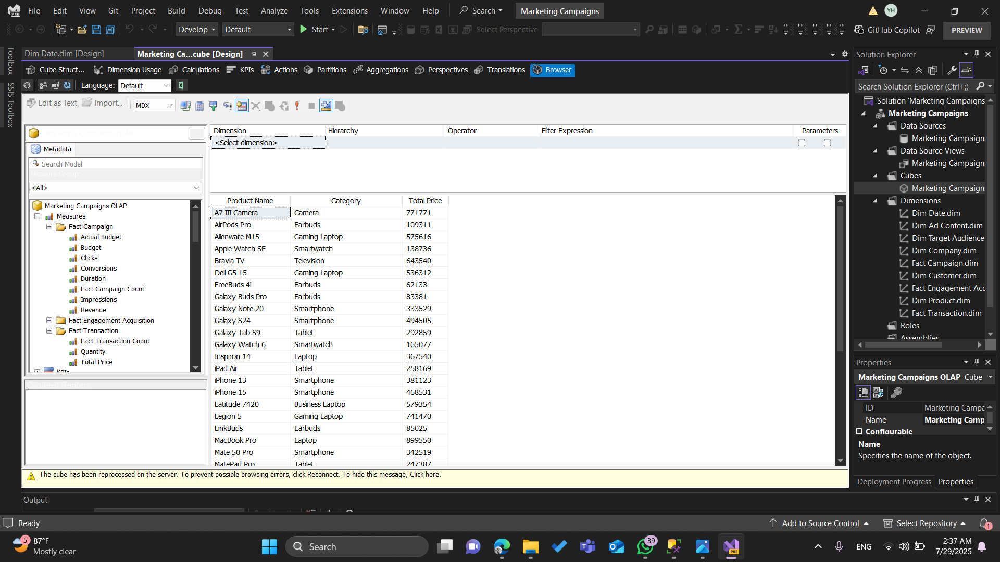
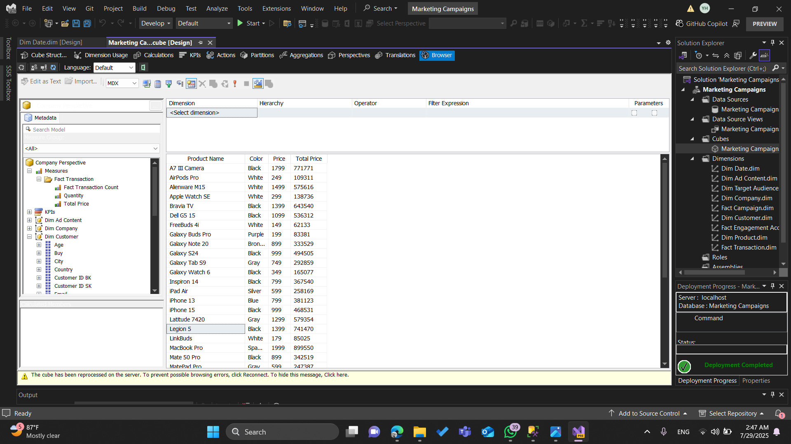

# SQL Server Analysis Services (SSAS) – Multidimensional Analytics & Data Modeling  

## SSAS Data Source View (DSV) – Overview  

  

The **Data Source View (DSV)** in SQL Server Analysis Services is essentially the blueprint of the cube’s data model. It visually maps out the structure of the database tables and how they are related to each other. Think of it as the *bridge* between the raw database and the analytical cube — it doesn’t store data itself, but it defines the logical relationships that SSAS will use to process and analyze information.  

In this project, the DSV is designed using a **star schema** layout. In this type of schema:  
- **Fact tables** capture measurable business events.  
- **Dimension tables** describe the context of those events.  

This results in a clean, efficient structure optimized for analytical queries.  

Key Highlights:  
- Central fact tables surrounded by dimension tables.  
- Relationships defined through primary/foreign keys.  
- Enables flexible slicing and dicing of business data (campaigns, customers, products, sales).  

---

## SSAS Cube Browser – Product Sales Analysis  
  
  

This screenshot illustrates the **Browsing phase** in SSAS after successfully designing and processing the cube. At this point, the cube has been built using fact tables, dimension tables, relationships, and calculated measures.  

### 1. Left Panel – Measures & Dimensions  
- **Measures Section**: Quantitative data from fact tables, including Actual Budget, Budget, Revenue, Clicks, Conversions, Impressions, Quantity, Total Price, etc.  
- **Dimensions Section**: Descriptive structures for slicing and dicing data, e.g.:  
  - **Dim Product** → product name, category, company.  
  - **Dim Company** → company name, industry, website.  
  - **Dim Date** → time-based analysis (monthly, quarterly).  
  - **Dim Customer** → customer demographics.  

### 2. Central Panel – Query Results Grid  
- Displays aggregated results.  
- Example: Product Name and Category vs. Total Price → highlights aggregated sales per product.  

### 3. Role in the Project Lifecycle  
- **Post-Processing Validation** → confirm cube is built correctly.  
- **Business Logic Testing** → validate measures like Total Price.  
- **Performance Evaluation** → ensure fast query response.  

### 4. Business Value  
- Enables interactive exploration without direct SQL.  
- Supports drill-down, roll-up, and quick KPIs.  
- Backbone for SSRS, Power BI, and Tableau reports.  

---

## SSAS Cube Browser – Marketing Campaign Analysis  
  

This screenshot demonstrates campaign performance analysis using the SSAS Cube Browser.  

### 1. Left Panel – Measures & Dimensions  
- **Measures**: Impressions, Revenue, Engagement metrics (Clicks, Shares), Transaction values.  
- **Dimensions**:  
  - **Dim Ad Content** → ad details.  
  - **Dim Company** → company info.  
  - **Dim Target Audience** → interest-based segments.  
  - **Dim Campaign** → campaign name, duration, theme.  

### 2. Central Panel – Query Results Grid  
- Rows: Campaign Name, Company Name, Target Audience Interests, Duration.  
- Enables quick analysis of campaign distribution, strategies, and targeting.  

### 3. Business Insights  
- Campaign targeting distribution across interests (Gaming, Fashion, Fitness, etc.).  
- Company strategies (short-term vs. long-term campaigns).  
- Seasonal alignment for promotional events.  

### 4. Role in OLAP Lifecycle  
- **Data Validation** → confirm correct dimension joins.  
- **KPI Preparation** → ROI, Conversion Rates, Cost per Impression.  
- **Performance Benchmarking** → compare campaign effectiveness.  

---

## SSAS Cube Browser – Product Sales Analysis View  

**Description:**  
Aggregated analysis of product sales performance across categories (e.g., Smartphones, Laptops, Earbuds, Smartwatches).  

**Dimensions Used:**  
- **Dim Product** → Product Name, Category.  

**Measure Used:**  
- **Total Price** (aggregated sum of transactions).  

**Purpose & Insights:**  
- Identify top-performing products for revenue.  
- Guide promotional investment and inventory planning.  
- Highlight demand-heavy categories (e.g., smartphones dominating revenue).  

**Example Insight:**  
- *“A7 III Camera” generated 717,771 in revenue.*  
- Smartphones lead multiple top spots → high demand.  

---

## SSAS Cube Browser – Marketing Campaign Performance View  

**Description:**  
Focuses on campaign-level performance (Campaign Name, Company, Target Audience Interests, Duration).  

**Dimensions Used:**  
- **Dim Campaign** → Campaign Name, Duration.  
- **Dim Company** → Company Name, Industry.  

**Purpose & Insights:**  
- Evaluate targeting strategy by interest categories.  
- Track campaign durations vs. effectiveness.  
- Portfolio management for company campaigns.  

**Example Insight:**  
- *“Boost Your Base” by Lenovo (Gaming) ran for 25 days.*  
- *Fashion campaigns (e.g., Brand Boost Deal, 43 days) → longer engagement approach.*  

---

## SSAS Cube Browser – Customer Purchase Behavior View  
  

**Description:**  
Analyzes customer-level purchasing (Customer ID, Purchase Count, Quantity, Total Price).  

**Dimensions Used:**  
- **Dim Customer** → Customer ID BK.  

**Measures Used:**  
- **Purchase Num** → number of purchases.  
- **Quantity** → total quantity bought.  
- **Total Price** → monetary value of purchases.  

**Purpose & Insights:**  
- Identify high-value customers (for loyalty programs).  
- Detect low-engagement customers (for reactivation).  
- Enable segmentation for targeted marketing.  

**Example Insight:**  
- *Customer CUST0023 made 14 purchases totaling 10,863.*  
- *Customers with only 1 low-value purchase → candidates for re-engagement campaigns.*  

---
