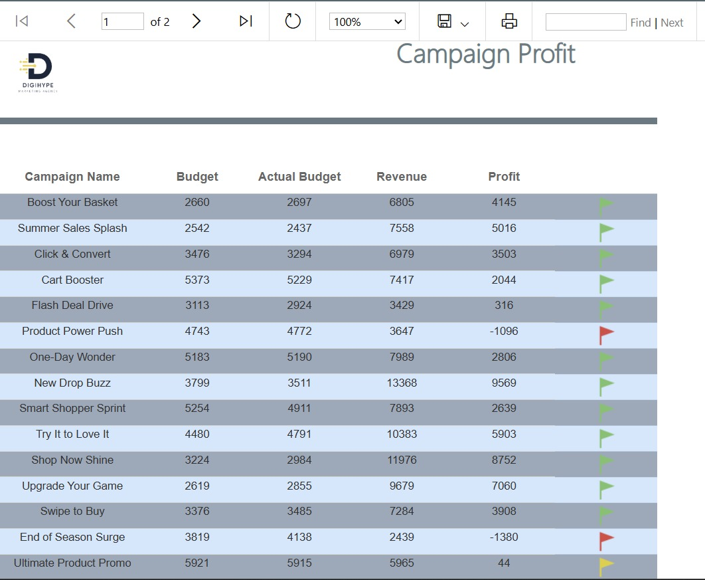
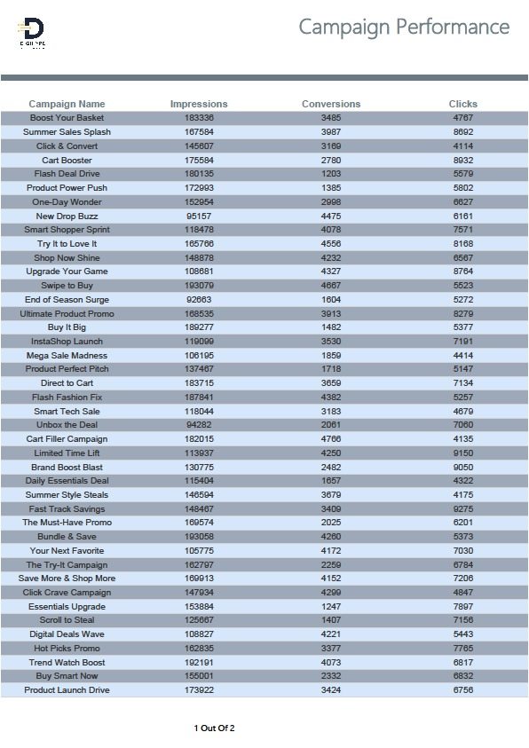
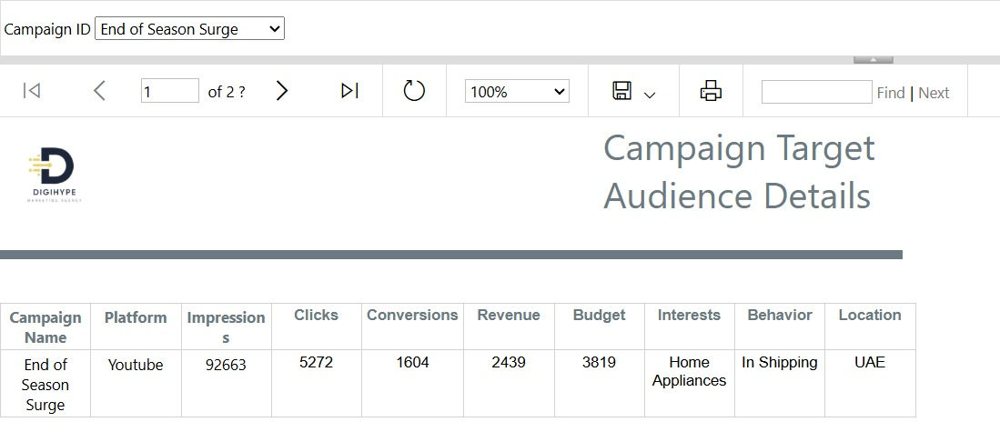

# SQL Server Reporting Services (SSRS) – Reporting Layer  

## Introduction  
The **SQL Server Reporting Services (SSRS)** layer represents the reporting and presentation tier of our **Business Intelligence (BI) architecture**.  
After the **ETL** process loads the Data Warehouse, and the OLAP Cubes (via SSAS) are built for multidimensional analysis, **SSRS** comes into play to transform this data into **visual, interactive, and understandable reports** for the end user.  

SSRS provides:  
- Custom reports tailored to business needs.  
- Tables, charts, KPIs, and visual indicators.  
- Parameter-based filtering to allow dynamic reporting.  
- Export capabilities to multiple formats (PDF, Excel, Word).  
- Integration with OLAP Cubes for drill-down and direct analysis.  

In this project, SSRS is directly connected to the **Marketing Campaigns Cube** built in SSAS, enabling users to explore data across **Products, Campaigns, Customers, and Transactions** without accessing raw data.  

---

## SSRS Reporting – Campaign Profit Analysis  
  

### Purpose & Scope  
This report is designed to provide insights into **marketing campaign performance** in terms of:  
- Planned Budget vs. Actual Budget.  
- Generated Revenue.  
- Profit (gain or loss).  

The main objective is to help stakeholders quickly identify which campaigns generated profit and which resulted in losses.  

### Data Source  
The data comes from the **Marketing Data Warehouse** and includes:  
- Campaign Name  
- Budget  
- Actual Budget  
- Revenue  
- Profit  

### Report Design  
- Well-structured tabular format.  
- Currency formatting for financial values.  
- Conditional formatting on the Profit column (losses highlighted in red).  
- Sorting & filtering to compare campaigns easily.  
- Pagination across three pages.  

### Key Insights  
- Campaigns like *Save More & Shop More* and *Click Crave Campaign* achieved strong ROI.  
- Campaigns like *Product Power Push* and *The Sale Swipe* resulted in losses.  
- Some campaigns exceeded the planned budget, while others underspent.  
- The wide variance highlights the importance of linking spending to actual performance.  

### Business Impact  
- Identify successful campaigns for repetition or expansion.  
- Investigate underperforming campaigns.  
- Optimize budget allocation for future campaigns.  
- Adjust strategy in real time.  

---

## Campaign Performance  
  

### Overview  
This section of the report focuses on **Engagement & Conversions** across campaigns.  

### Data Fields  
- Campaign Name  
- Impressions  
- Conversions  
- Clicks  

### Key Observations  
- Campaigns like *Shop the Trend* and *Shopping Simplified* achieved high conversions.  
- Campaigns like *Must Buy Moment* generated high impressions but low conversions.  
- Highlighting that clicks do not always translate into conversions.  

### Purpose  
- Identify campaigns with both **high reach and strong conversions**.  
- Highlight campaigns needing improvement in offers or creatives.  
- Support overall strategy by aligning with profit data.  

---

## Campaign Target Audience Details  
  

### Overview  
This section links campaign performance to the **target audience segments**.  

### Data Fields  
- Campaign Name  
- Platform  
- Impressions, Clicks, Conversions, Revenue, Budget  
- Interests, Behavior, Location  

### Key Observations  
- Example: *Boost Your Basket* targeting **Gaming + Frequent Buyers (UK)** → achieved Impressions = 183,336, Conversions = 3,485, Revenue = 6,805.  
- Connects campaign performance to demographics, interests, and consumer behavior.  

### Purpose  
- Evaluate performance audience-wise.  
- Improve targeting strategies.  
- Link financial outcomes to demographic targeting.  

---

## Business Value of SSRS Layer  
- Empower management with **data-driven decision-making**.  
- Provide insights into **Campaign ROI, Engagement, and Audience Fit**.  
- Support business in optimizing **Marketing Strategy, Budget Allocation, and Customer Targeting**.  

